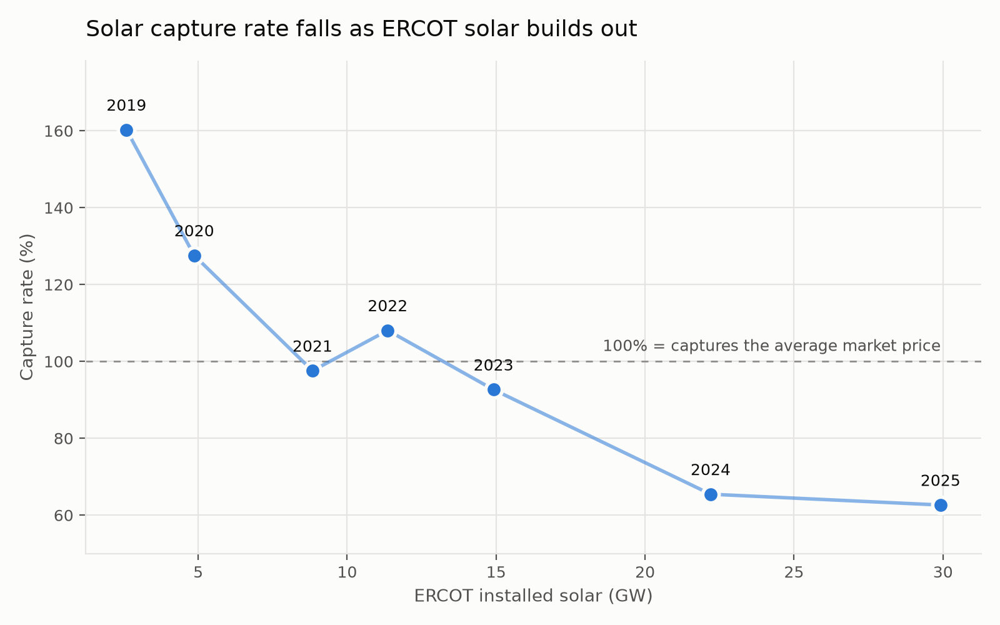

# Solar VPPA Settlement & Basis Engine

[](https://github.com/BallerBrahma/VPPA-Engine/actions/workflows/ci.yml)

A library that settles virtual power purchase agreements for utility-scale solar
and quantifies the basis and shape risk buried in them.

## The question

A VPPA is priced against average forward power prices, but it settles against the
hours a solar project actually produces. Solar generates when solar suppresses
prices — so does a deal struck at a "fair" average price end up structurally
underwater once you settle it hour by hour?

In ERCOT West, yes, and by a widening margin.

## The finding

Holding the generation profile constant and varying only the year's prices, a
West Texas solar project's **capture rate fell from 160% in 2019 to 63% in 2025**
as ERCOT's installed solar grew from 2.6 GW to 29.9 GW. The correlation between
penetration and capture rate is **−0.911**.



In 2019 solar was scarce and midday *was* the system peak, so the asset earned a
60% premium over the average market price. By 2025 it captured barely three-fifths
of that average. Negative-price hours at HB_WEST rose from 33 to 341 a year.

**The 2019 endpoint is inflated, and the honest version of this chart says so.**
That 160% is mostly one event: August and September 2019 cleared at 196% and 198%
capture during ERCOT's record-low reserve margin, with 35 hours above $1,000/MWh
and 27.8% of the year's revenue arriving in 20 hours. Solar happened to be
generating through a scarcity crisis. Every other month that year sat near 100%.
So the 160% → 63% span mixes a real penetration effect with a rare scarcity
windfall at the start. The penetration effect survives on its own: from 2023 to
2025, with no comparable scarcity event, capture still fell 92.6% → 62.6%.

Settling the example contract against real 2024 prices:

| Metric | Value |
|---|---|
| Annual capture rate | 65.5% |
| Breakeven strike | **$19.20/MWh** |
| Contract strike | $34.50/MWh |

The project would need a strike of $19.20 to break even on its actual production
shape. At $34.50 the buyer is underwater by roughly $15/MWh — not because the
strike was above the average market price, but because it was above the price the
asset *captures*.

### Is the typical-year shortcut distorting this?

No, and it is worth checking rather than asserting. Re-running the example
contract against each year's *actual* NSRDB weather:

| Year | Capture (TMY) | Capture (actual) | Difference |
|---|---|---|---|
| 2023 | 92.6% | 92.3% | −0.33 pp |
| 2024 | 65.5% | 65.2% | −0.26 pp |
| 2025 | 62.6% | 61.2% | −1.48 pp |

TMY tracks actual weather to within 1.5 points and is consistently a little
optimistic. Note 2025 delivered 4.1% *more* generation than a typical year yet
captured a *lower* share of the average price — the extra sunlight arrived in
hours that were worth less, which is the thesis restated from the weather side.

## Basis: the risk a hub-settled deal leaves on the table

A hub-settled VPPA pays out against the hub, but the project sells at its own
node. That gap — basis — is unhedged. Three real ERCOT assets, three years,
settled against their own nodes:

| Project | Zone | Year | Capture (hub) | Capture (node) | Mean basis | **Cost of basis** | Neg-basis hrs |
|---|---|---|---|---|---|---|---|
| Lamesa (Dawson Co.) | West | 2023 | 94.2% | 94.1% | −$0.05 | −$0.07 | 29% |
| | | 2024 | 65.8% | 63.5% | +$1.52 | +$0.29 | 35% |
| | | 2025 | 63.0% | 47.6% | +$16.78 | +$2.78 | 7% |
| Noble (Denton Co.) | North | 2023 | 93.8% | 94.1% | −$0.62 | −$0.40 | 76% |
| | | 2024 | 74.9% | 75.9% | +$0.14 | +$0.37 | 61% |
| | | 2025 | 70.3% | 70.3% | −$2.46 | −$1.73 | 62% |
| Sun Valley (Hill Co.) | Central | 2023 | 94.2% | 94.2% | +$0.09 | +$0.07 | 23% |
| | | 2024 | 76.7% | 74.1% | −$0.46 | −$1.06 | 38% |
| | | 2025 | 70.8% | **34.4%** | −$5.22 | **−$13.79** | 57% |

Three things fall out of this:

**The decay is not local to one site.** Capture rate fell in every project and
every zone, 2023 → 2025: 94% → 63% (West), 94% → 70% (North), 94% → 71%
(Central). This is a market-wide repricing of solar hours, not an artifact of one
node.

**Generation-weighting usually moves basis against the project.** In 6 of 9
project-years, the generation-weighted cost of basis is worse than the simple
hourly mean — congestion bites hardest in the hours the plant is running. Lamesa
2025 is the cleanest illustration: its node averaged **+$16.78/MWh above** the hub
across all hours, but only **+$2.78/MWh** in the hours it actually generated. The
good basis accrues overnight, when the panels are dark. Noble is the exception,
running slightly *better* when generating.

**Basis risk is project-specific and can arrive suddenly.** Two of the three
projects carried negligible basis for three years. Sun Valley then lost
**$13.79/MWh** in 2025 — its node captured 34% of the average price while its hub
captured 71%. A separate cross-section of all 88 ERCOT solar nodes over a recent
31-day window found generation-weighted basis ranging from roughly zero to
**−$21.52/MWh**. Nothing about a hub-settled deal protects against that, and it
cannot be estimated from hub data alone.

## Scenarios

Stresses are applied to `settle()`'s *inputs*, never to its results, so a
scenario can never drift from what the engine would actually compute. Sun Valley
2025, settled at its node against a $32.00 strike:

| Scenario | Generation (MWh) | Capture rate | Breakeven | Cash to buyer |
|---|---|---|---|---|
| base | 496,969 | 34.4% | $15.61 | −$8.15M |
| P90 production | 452,384 | 34.4% | $15.61 | **−$7.42M** |
| price collapse (−30%) | 496,969 | 34.4% | $10.93 | −$10.47M |
| bad basis year (−$10/MWh) | 496,969 | −2.6% | $8.66 | −$11.60M |
| combined stress | 452,384 | −35.3% | $4.35 | −$12.51M |

Note the P90 row: a **worse** production year leaves the buyer **better off**.
The contract is underwater in every lit hour, so less production means less
volume to pay out on. P90 is a downside case for the *seller*, which is why
these are read per counterparty rather than collapsed into one "bad case"
number. Under a bad-basis year the capture rate goes negative outright — the
generation-weighted price the asset earns falls below zero while the market
average stays positive.

## Storage: what it would take to fix it

Pair each project with a 4-hour battery at roughly 25% of AC capacity, charging
only from its own output, and dispatch it optimally against 2025 nodal prices.
The battery decides for itself whether an oversupplied hour is worth storing or
better spilled, so curtailment and storage compete inside the same optimisation
rather than being stacked on top of one another:

| Project | As generated | After curtailment | With storage | Storage's own share of the uplift |
|---|---:|---:|---:|---:|
| Lamesa (West) | 47.6% | 49.4% | 73.8% | $2.64M of $2.66M |
| Noble (North) | 70.3% | 76.6% | 103.7% | $4.08M of $4.42M |
| Sun Valley (Central) | 34.4% | 74.1% | **110.0%** | $4.17M of $7.19M |

Splitting those two columns matters, and it corrects this project's own earlier
claim. Sun Valley used to be reported as a +38.2 point storage uplift. Properly
decomposed, curtailment does 39.7 points of that work and the battery does
35.9 — **$3.02M of what was credited to storage was simply the plant declining
to sell at a loss**, which needs no capital at all. That is exactly the error
the limitations section used to warn about, now measured instead of suspected.

Capture rates above 100% are not a bug. Once the plant stops selling into
negative hours, its delivered energy is weighted entirely toward above-average
prices, so the generation-weighted average can exceed the time-weighted one.
It means the plant sold only into good hours, not that it beat the market.

The battery is far from a complete answer even so. Sun Valley still spills
91,879 MWh — around 30% of output — because a 248 MWh battery cannot absorb 736
hours of negative pricing.

**What is still a ceiling:**

- **Foresight.** The headline LP optimises against the whole year's realised
  prices at once. Solving each ERCOT operating day independently, which is far
  closer to what a day-ahead bidder knows, costs about 9.5% of the uplift
  ($2.43M against $2.66M at Lamesa). Both modes still use realised rather than
  forecast prices, so even the daily figure is optimistic.
- **Degradation is now charged** at `cycling_cost_usd_mwh`, defaulting to
  $4/MWh discharged in the shipped contracts -- $133k to $337k a year here,
  7-9% of the uplift. It barely changes the dispatch, because ERCOT's daily
  spreads dwarf $4/MWh, but it is a real cost against the revenue. The
  optimiser now cycles 359-390 times a year rather than 390-450, since an
  inverter constraint stops it charging and discharging in the same hour.
- **No capex.** This is gross revenue uplift and says nothing about whether the
  battery pays for itself. A 62 MW / 248 MWh system is a nine-figure capital
  decision this model does not attempt.

Round-trip losses are real in the figures: delivered volume is strictly below
generation net of curtailment, so every dollar of uplift comes from better price
capture rather than from more energy.

## Curtailment: the hours the plant declines to sell

A solar plant is not obliged to generate. When the price is below what the
operator nets per megawatt-hour, exporting destroys value and the plant stops.
Those are exactly the saturated hours this project is about, so a model that
exports through them overstates both volume and loss.

Curtailment is now a contract term (`curtailment.curtail_below_usd_mwh`) and
the effect is large where prices actually go negative:

| Lamesa, hub-settled, 2025 | uncurtailed | curtailed |
|---|---:|---:|
| Delivered volume | 233,616 MWh | 213,402 MWh |
| Capture rate | 63.0% | **70.2%** |
| Net cash to buyer | -$2.42M | **-$1.77M** |

Curtailment removes 8.65% of output across 303 hours and makes the buyer
$650,000 *better* off, which is the opposite of what "lower volumes" suggests.
Every curtailed hour was one the buyer was paying into: at a price below the
strike, not producing is worth more to them than producing. Volume falls and
losses fall with it.

**It barely matters at the hub, and enormously at the node.** HB_NORTH did not
print a single negative day-ahead hour in 2025 — its minimum was exactly $0.00 —
so the four North Texas contracts curtail nothing. Their nodes are a different
market entirely:

| Node, 2025 | negative hours | curtailed | capture rate |
|---|---:|---:|---:|
| `SUNVASLR_ALL` (Sun Valley) | 736 | 24.1% | 34.4% -> **74.1%** |
| `NOBLESLR_ALL` (Noble) | 433 | 5.7% | 70.3% -> 76.6% |
| `LAMESASLR_G` (Lamesa) | 110 | 3.4% | 47.6% -> 49.4% |

Sun Valley's node spent 736 hours below zero in a year its hub never went
negative once. The 34.4% nodal capture rate reported further up this README
assumed the plant exported through all of them; no operator would. Curtailment
more than doubles it.

**Whether the project earns the production tax credit dominates the answer.**
The credit is earned per megawatt-hour produced, so a PTC project keeps
generating to roughly -$27.50/MWh — which is much of why ERCOT goes negative at
all. At that threshold Sun Valley's 2025 curtailment falls from 24.1% to 12.3%,
and Lamesa's 2024 from 8.5% to 0.04%. The model takes the walk-away price as an
input rather than assuming the plant is irrational.

Only *economic* curtailment is modelled. ERCOT also curtails for congestion and
reliability reasons unrelated to price, so treat these as a lower bound.

## Architecture

Five layers, one direction of flow, with two thin front ends on top:

```
ingest/   pull prices (gridstatus), generation (PySAM), capacity (EIA)
store/    immutable Parquet cache, partitioned by source / key / year
model/    typed domain objects; all validation lives here
engine/   pure functions: settle, capture_rate, basis, scenarios, dispatch
report/   monthly statements and charts
          |
          +-- cli.py       `vppa settle ...`
          +-- api/         FastAPI, consumed by the Next.js app in web/
```

Cached generation is keyed by a fingerprint of the modelled plant -- location,
DC capacity, loading ratio, tilt, azimuth, losses, mounting -- not by contract
name. Anything the web editor can change that PVWatts reads therefore lands in
its own partition, so a re-tuned project is re-run rather than silently served
the previous version's series. Paperwork that PVWatts never sees (the strike,
the floor) does not move the key, so re-striking a deal still reuses the run.

Contracts reach the engine three ways -- picked from `contracts/`, uploaded as
JSON, or typed into the form -- and all three go through the same pydantic
`Contract`. The form validates against the server on every edit rather than
against a second copy of the rules in the browser, because a client-side schema
that drifted from the model would be worse than no check at all.

That makes a contract's fields user-supplied, which matters more than it looks:
the name, hub and node become directory names in the Parquet cache, so a typed
`../../..` would have written outside the data directory. Those fields are
constrained in `model.py`, and `store.cache_path` independently refuses any key
that is not a single directory name and confirms the resolved path is still
contained.

The engine layer holds every number the project reports and does no I/O, so it
is testable from small in-memory fixtures with no network. Both front ends are
deliberately thin: they fetch, align and display, but compute nothing, so the
web UI cannot drift away from what the CLI prints. The API reuses the same
pydantic `Contract` the CLI loads, so an uploaded or edited deal is validated
by exactly the same rules.

## The contracts

Seven hypothetical deals on real ERCOT assets, plus one schema demo. Plant
identity, location, AC capacity and commercial operation date come from
EIA-860; every settlement point is checked against ERCOT's own resource-node
registry. Strikes and terms are illustrative.

| Project | MW | Region | Node | Mounting | Battery | Online |
|---|---:|---|---|---|---|---|
| Five Wells Solar Center | 355.4 | North | `FIVEWSLR_ALL` | tracking | 89 MW | Dec 2023 |
| Noble Solar | 275.0 | North | `NOBLESLR_ALL` | fixed | 69 MW | Sep 2022 |
| Sun Valley Solar | 250.0 | North | `SUNVASLR_ALL` | fixed | 62 MW | Dec 2022 |
| Eiffel Solar | 240.0 | North | `EIFSLR_UNIT1` | tracking | — | Nov 2023 |
| Zier Solar | 160.0 | South | `ZIER_SLR_ALL` | tracking | — | Apr 2024 |
| Starr Solar Ranch | 136.0 | South | `STAR_SLR_RN` | tracking | — | Nov 2024 |
| Lamesa Solar | 102.0 | West | `LAMESASLR_G` | fixed | 25 MW | Apr 2017 |
| Example deal | 150.0 | — | fictional | fixed | — | — |

Five Wells is a genuine AC-coupled hybrid, so its battery is a real paired
asset rather than the "what if" overlay the older contracts carry. The example
deal's node is deliberately fictional, which is what makes it the contract
that exercises the availability check below.

### What seven projects show that three did not

Hub-settled, typical weather, 2025. The breakeven strike is the strike at which
each deal settles to exactly zero -- it is computed from the price shape, not
chosen, so unlike the illustrative strikes it is a real result.

| Project | Region | Mounting | Capture rate | Breakeven strike |
|---|---|---|---:|---:|
| Zier Solar | South | tracking | 77.6% | $25.50 |
| Starr Solar Ranch | South | tracking | 75.9% | $24.93 |
| Five Wells Solar Center | North | tracking | 75.1% | $24.73 |
| Eiffel Solar | North | tracking | 73.8% | $24.31 |
| Sun Valley Solar | North | fixed | 70.8% | $23.33 |
| Noble Solar | North | fixed | 70.3% | $23.15 |
| Lamesa Solar | West | fixed | 63.0% | $21.64 |

Two things fall out that three West/North projects could not show. First, the
ordering is South > North > West, and West is worst by a wide margin -- the
zone carrying ERCOT's heaviest solar concentration is the one where solar
earns least, which is the thesis expressed geographically rather than over
time. Second, the four North-zone projects settle against the same hub in the
same year, so mounting is the only thing separating them: the two tracking
plants capture 73.8-75.1% against 70.3-70.8% for the two fixed-tilt ones. That
+3 to +5 point gap is measured on different hardware at different sites, and it
independently reproduces the +4.1 points found by re-running Lamesa itself as a
tracker.

No project clears 78%, and every breakeven strike lands between $21.64 and
$25.50/MWh. A deal struck against a time-weighted forward is above that band
before basis, before curtailment, and before any of it is negotiated.

## The map

The landing page opens on all eight projects plotted on an OpenStreetMap
basemap, sized by contracted capacity and clickable to load a deal. It is there
because the headline result is partly geographic: West Texas sits in ERCOT's
densest solar cluster and captures 63.0% against 70-78% everywhere else, and
that is easier to see on a map than in a table of node names.

Nothing on the map is geocoded. Every real asset carries a surveyed coordinate
from EIA-860, and replacing one with the centroid of a county would be less
accurate, not more. Geocoding earns its place in one spot instead: the contract
editor can move a project to a named place, for a deal being written against a
site with no EIA row yet. That goes through `/api/geocode`, which proxies
OpenStreetMap's Nominatim server-side so its usage policy is actually honoured
-- one request per second, an identifying User-Agent, and cached results -- and
warns that a place centroid will move the modelled weather site.

Tiles are CARTO's raster renderings of OpenStreetMap data, in a light and a
dark style, so the basemap follows the app's colour scheme instead of stranding
dark mode on a bright map.

## Knowing what can be run before running it

Not every contract-year is answerable, and the old UI found that out the
expensive way: it offered every combination, then failed the analysis with a
traceback. Three of those questions have free answers, so `/api/availability`
answers them up front and the UI disables the control instead:

- **Is this a real settlement point?** ERCOT publishes its resource-node list,
  and `ingest/settlement_points.py` caches it. The example deal's
  `WESTSOLAR_ALL` is not in it, so node settlement is greyed out with that
  reason rather than burning a metered nodal query to discover it.
- **Did the plant exist yet?** Nodal prices start at commercial operation.
  Starr Solar Ranch energised in November 2024, so 2023 is refused and 2024 is
  offered but labelled a partial year.
- **Has the weather been published?** NSRDB lags by about a year, so actual
  weather for an incomplete year is not offered.

Both registry reports come from ERCOT's free public MIS, not the metered
gridstatus.io API, so refreshing the list costs nothing. A machine that has
never pulled it degrades to permissive -- an absent registry must not make
every node look fake.

## Contract terms that actually bind

Every field in a contract YAML changes a number somewhere; none are decorative:

- **`escalation_pct_yr`** compounds the strike annually from the first year of
  the term, so a 2.5% escalator on a $32.00 strike settles 2024 at $32.80 and
  2025 at $33.62.
- **`counterparty_view`** flips the reported sign. `settle()` always returns
  `cash_to_buyer` as the single canonical convention; a seller-view contract
  reports the negation rather than quietly showing the buyer's P&L.
- **`term`** is checked against the settled year. Settling outside it is allowed,
  because "what would this deal have done in 2019?" is a fair question, but the
  CLI says out loud that it is a counterfactual.
- **`negative_price_floor`** caps how far a negative index price can push the
  settlement, while the raw price is preserved unclipped for analysis.
- **`storage`** is optional; when present the CLI and UI report the overlay.

## How VPPA settlement works

A VPPA is a financial swap layered on top of physical market sales. The generator
sells its output into the market at the local price. Separately, buyer and seller
exchange the difference between that price and a fixed strike:

    cash_to_buyer = (index_price − strike) × generation_mwh

When the market clears above the strike the buyer receives the difference; below
it, the buyer pays. The volume is whatever the sun delivers that hour, never a
flat block — which is precisely why the shape matters and why an average price is
the wrong thing to price against.

## Assumptions

These are choices, not facts, and they move the numbers:

- **Typical weather by default, actual weather available.** Generation defaults
  to a TMY (typical meteorological year) file, which is deliberate for the decay
  analysis: holding weather fixed means a change in capture rate can only come
  from prices. Pass `--weather actual` (or `weather="actual"`) to use that year's
  real NSRDB weather instead, which is what a specific year's P&L needs. The two
  are cached separately and never substituted for one another.
- **Inverter loading ratio 1.30**, set explicitly. PVWatts otherwise defaults to
  1.2 regardless of the project, and the ratio changes capture rate materially by
  clipping midday peaks.
- **Fixed-tilt, open rack by default.** Mounting is a contract field
  (`project.tracking`: `fixed`, `single_axis`, `single_axis_backtracked`), not a
  hardcoded constant. The shipped contracts stay fixed-tilt so the numbers above
  stay comparable, but many real ERCOT plants track. Switching Lamesa to
  backtracked single-axis for 2025 raises annual output 27.6% (233,616 ->
  298,065 MWh) and capture rate 4.1 points (63.0% -> 67.1%): tracking pushes
  output into the evening, when prices are higher. It does not rescue the
  thesis -- 67.1% is still deeply under a time-weighted average.
- **Prevailing-time alignment.** NSRDB reports weather in fixed standard time;
  ERCOT settles on prevailing local time with DST. Generation is mapped onto the
  region's real DST-observing zone so hours line up with market hours year-round.
- **Calendar reconciliation.** A TMY year has no Feb 29 and cannot represent DST's
  doubled fall-back hour, so price hours without a generation counterpart are
  dropped explicitly (25 hours in a leap year) rather than silently misaligned.
- **Strikes are illustrative.** The contracts in `contracts/` are written on real
  assets with real locations and capacities from EIA-860, but the strike prices
  are made up. They are not real deals.

## Limitations

- The TMY default is an approximation, but a measured one. Re-running the example
  contract on actual NSRDB weather moves capture rate by 0.33 pp (2023), 0.26 pp
  (2024) and 1.48 pp (2025), always slightly *lower* than TMY suggests. The decay
  finding is not a TMY artifact, but per-year figures on the default basis are
  optimistic by up to about 1.5 points.
- 2021 breaks the decay trend (97.6%, rebounding to 108% in 2022). That is Winter
  Storm Uri: the year's average price was $142.66/MWh, distorted by a handful of
  hours at the $9,000 cap. The denominator is doing that, not the thesis.
- Capture rate is computed against day-ahead hub prices. A project settling
  real-time, or at its own node, faces a different number.
- Only *economic* curtailment is modelled -- the plant stopping because the
  price is below its walk-away point. ERCOT also curtails for congestion and
  reliability reasons that have nothing to do with price, and none of that is
  here, so the curtailment figures above are a lower bound.
- The battery still charges only from the project's own output, and carries no
  capex. Two of the three things that made its uplift an upper bound are now
  measured rather than assumed: degradation is charged per MWh discharged
  (`cycling_cost_usd_mwh`, 7-9% of the uplift at $4/MWh), and the
  perfect-foresight assumption is bounded by solving each operating day on its
  own, which is closer to what a day-ahead bidder knows. That premium is about
  9.5% of the headline figure. Together they take roughly a sixth off it.
- The daily-foresight comparison is a bound, not a simulation. A real bidder
  works from forecast prices, not the realised ones both modes use here, so
  even the day-at-a-time number is optimistic.
- Nodal price history comes from a commercial API (gridstatus.io); ERCOT's free
  archive covers only hubs and load zones, plus a ~31-day rolling window of nodal
  prices.
- The 2019 capture rate (160%) is a scarcity artifact as much as a penetration
  one — see the note under the headline. Read the 2023–2025 decline as the
  cleaner measure of the shape effect.
- Capture rate is sensitive to a handful of extreme hours in any scarcity year,
  so single-year comparisons across ERCOT's price spikes should be treated with
  care. Nothing here winsorises or caps prices.
- One ISO. Everything here is ERCOT.

## Reproducing

```bash
uv sync --extra dev
cp .env.example .env        # then add your NREL, gridstatus.io and EIA keys
uv run pytest               # 84 tests, no network required
uv run vppa settle contracts/example_ercot_west.yaml --year 2024
uv run vppa settle contracts/lamesa_west.yaml --year 2025 --weather actual
```

For the web interface, run the API and the front end together:

```bash
uv run uvicorn vppa.api:app --reload --port 8000    # http://localhost:8000/docs
cd web && npm install && npm run dev                # http://localhost:3000
```

The test suite is deliberately offline and deterministic: every number it checks
comes from a small hand-built fixture. Network-backed behaviour is verified by
one-off runs against the real APIs, not in CI.

## Design

See [solar-vppa-engine-design.md](solar-vppa-engine-design.md) for the full
architecture, data sources, known traps, and build phases.
